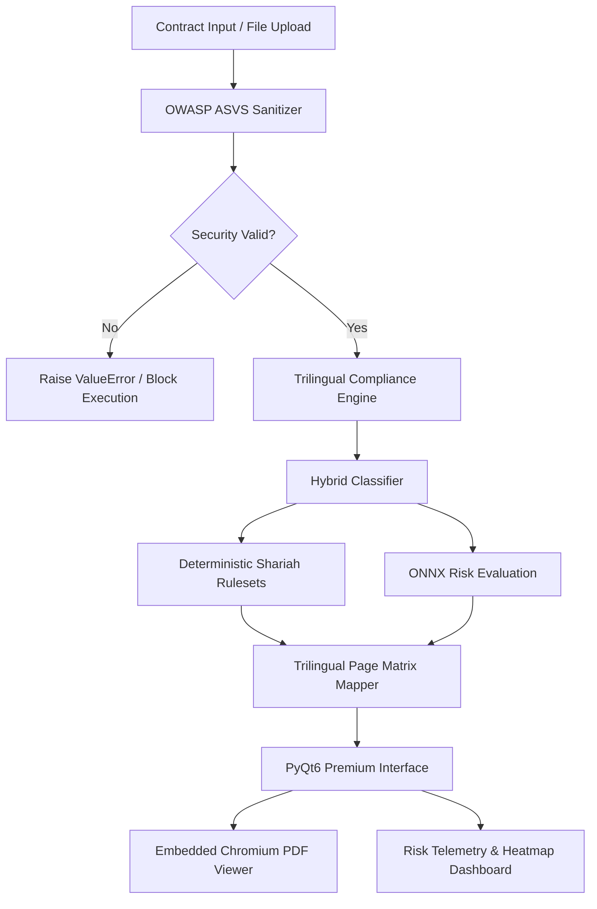

# ⚖️ AAOIFI Shariah Compliance Engine (aaoifi-shariah-compliance-engine)

[](LICENSE)
[](https://www.python.org/)
[](https://pypi.org/project/PyQt6/)
[](#security-hardening-owasp-asvs)

A secure, enterprise-grade, **trilingual compliance verification engine** designed for auditing financial contracts against official **AAOIFI (Accounting and Auditing Organization for Islamic Financial Institutions)** standards. 

Powered by a hybrid deterministic-classifier architecture utilizing **ONNX Machine Learning Models**, this system automates risk assessment, identifies violations, suggests remediation steps, and synchronizes document views across **Turkish, English, and Arabic** locales.

---

## 🌟 Key Features

*   🌍 **Trilingual Engine**: Full native parsing and analysis in **Turkish, English, and Arabic (العربية)**.
*   🧠 **GAT ONNX Classifier**: Classifies contracts and gauges compliance risks with real-time confidence scores using an optimized Graph Attention Network model.
*   📐 **Deterministic Rulesets**: 12 fully mapped and audited Islamic financial standards including:
    *   *Sarf (Standard 1)*, *Vedia (Standard 5)*, *Murabaha (Standard 8)*, *Ijarah (Standard 9)*, *Salam (Standard 10)*, *Istisna (Standard 11)*, *Musharaka (Standard 12)*, *Mudarabah (Standard 13)*, *Sukuk (Standard 17)*, *Karz (Standard 19)*, and *Takaful (Standard 26)*.
*   🗺️ **Dynamic Page Alignment**: Automatically links detected contract violations to the exact page range inside the authoritative Arabic, English, and Turkish AAOIFI PDF documents.
*   🛡️ **OWASP ASVS Hardened Core**: Implements rigorous security sanitization preventing:
    *   *Null Byte Injection (`\x00`)*
    *   *Directory Traversal / Path Injection*
    *   *File Upload Spoofing / Extension Bypass*
    *   *ReDoS (Regular Expression Denial of Service)*
*   📊 **Premium UI Dashboard**: Built on PyQt6 with a dark-mode palette, risk level gauges, interactive compliance heatmaps, and a embedded PDF viewer utilizing Chromium-backed QWebEngine.

---

## 🏗️ System Architecture



---

## 🛡️ Security Hardening (OWASP ASVS)

To meet the highest safety standards of banking software (OWASP Application Security Verification Standard), this project has implemented several defense-in-depth mechanisms:

1.  **Input Sanitation**: Evaluates raw inputs, blocking scripts, invalid HTML tags, and truncating texts at 250,000 characters to prevent ReDoS.
2.  **Null Byte Check**: Completely filters `\x00` characters to prevent file poisoning.
3.  **Strict Path & Extension Whitelisting**: Resolves file access attempts to secure paths only. Uploads require matching file headers/magic signatures for approved formats (`.pdf`, `.docx`, `.txt`, `.md`).
4.  **Secure WebEngine Environment**: Disables remote URL access from local file contexts in QWebEngine and restricts clipboard scripts.

---

## ⚡ Quick Start

### Prerequisites
*   Python 3.10 or higher
*   PyQt6
*   ONNX Runtime

### Installation
1.  Clone the repository:
    ```bash
    git clone https://github.com/mahmut808/aaoifi-shariah-compliance-engine.git
    cd aaoifi-shariah-compliance-engine
    ```
2.  Install dependencies:
    ```bash
    pip install -r requirements.txt
    ```
3.  Run the application:
    ```bash
    python3 app_main.py
    ```

## ⚖️ Intellectual Property & Copyright Disclaimer

*   **English and Turkish Versions**: The English and Turkish versions of the AAOIFI Shariah standards incorporated in this repository are compiled from publicly distributed reference documents.
*   **Arabic Version**: The Arabic Shariah standards document (`723607313-معايير-الأيوفي-الشرعية-النسخة-العربية-2017.pdf`) is a copyrighted publication of AAOIFI. The developers and users of this repository must ensure they possess the necessary rights or licenses to use and display these documents in their respective production deployments.
*   All brand names, trademarks, and copyright assets related to AAOIFI standards are the sole property of **AAOIFI (Accounting and Auditing Organization for Islamic Financial Institutions)**. This repository does not claim any ownership over the original text of the standards.

---

## 📄 License & Pricing Model

This project is licensed under the **Business Source License 1.1 (BSL 1.1)**. 

### 🎓 Non-Commercial Use (Free)
*   **Academics, Students, and Individuals**: Fully free for educational, research, personal, and non-commercial development use.

### 🏢 Commercial Use (Annual Subscription)
Any commercial or production deployment by financial institutions requires a paid annual subscription based on the size of the organization:

*   **Small Participation Banks**: **$15,000 USD / Year**
*   **Large Participation Banks / Enterprise Entities**: **$25,000 USD / Year**

For commercial licensing agreements, custom enterprise support, or corporate invoicing, please contact **mahmut808** via GitHub or standard corporate inquiries.

On **January 1, 2030**, the license will automatically convert to the **Apache License, Version 2.0**.
